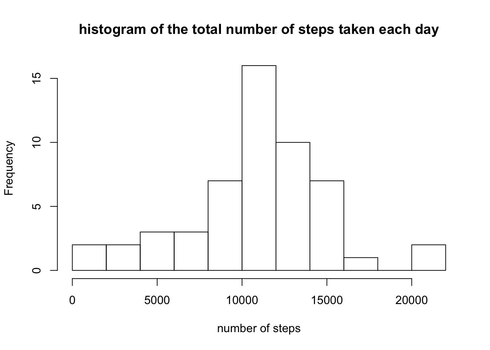
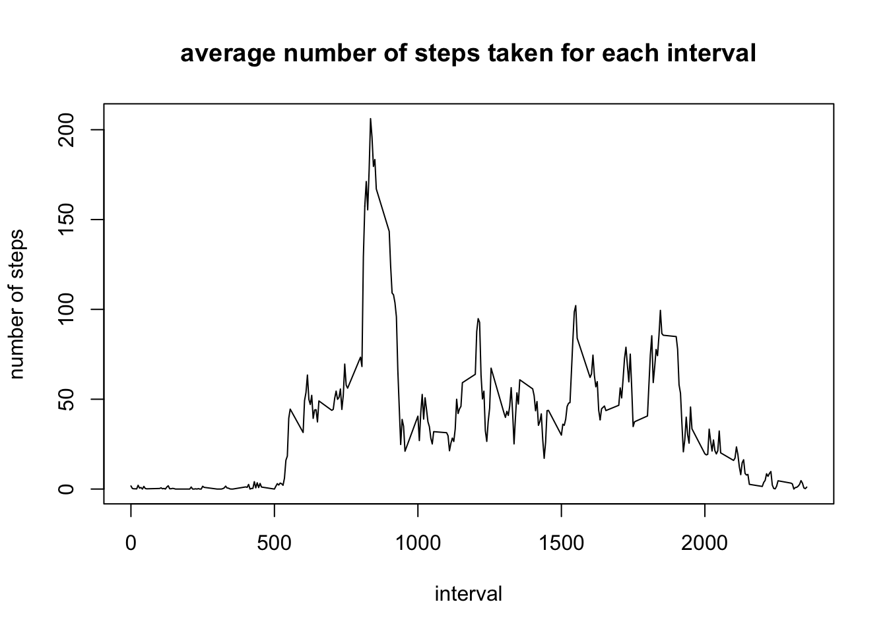
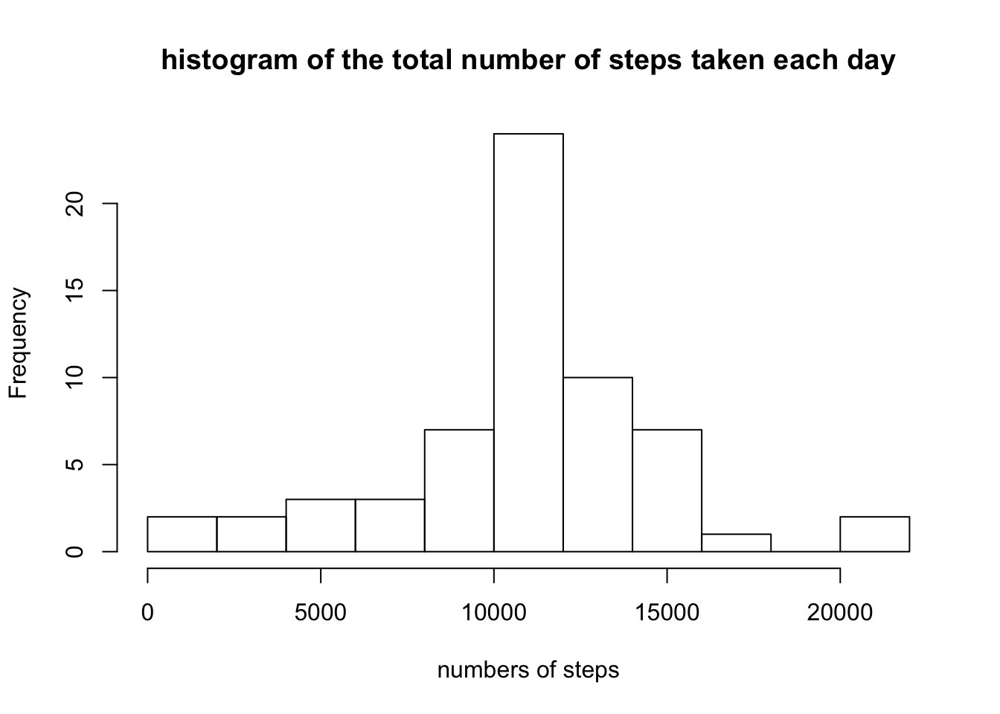
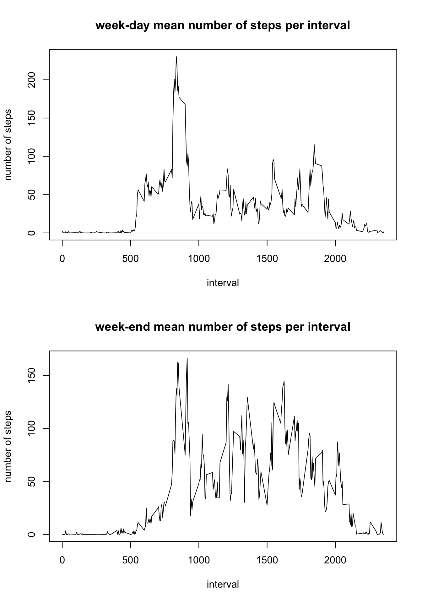

I. Loading and preprocessing the data
-------------------------------------

We start by opening the data file and turning the date column into date
data.

    setwd("/Users/gregoireflahault/Desktop/Coursera/Rep_Data_W2")
    dat<-read.csv(file = "activity.csv")
    dat$date<-as.Date(dat$date, "%Y-%m-%d")
    par(mfrow=c(1,1))

II. What is mean total number of steps taken per day?
-----------------------------------------------------

We sum the number of steps for each day into the agg variable. Then we
plot the frequency of the number of steps

    agg<-aggregate(dat$steps, list(date= dat$date), FUN=sum)
    hist(agg$x, breaks = 10, main= "histogram of the total number of steps taken each day", 
                             xlab = "number of steps")

 

Then i calculate the mean and the median values of those sums

    mean(agg$x, na.rm=TRUE)

    ## [1] 10766.19

    median(agg$x, na.rm=TRUE)

    ## [1] 10765

III. What is the average daily activity pattern?
------------------------------------------------

Then we calculate the mean number of step for each interval over the 2
months And we plot this.

    agg_2<-aggregate(dat$steps, list(interval = dat$interval), FUN=mean, na.rm=TRUE)
    with( agg_2, plot(x = interval, y = x, 
                 type = "l",
                 main = "average number of steps taken for each interval",
                 ylab = "number of steps"))

 

The interval with the highest mean number of steps

    agg_2$interval[agg_2$x==max(agg_2$x)]

    ## [1] 835

IV. Imputing missing values
---------------------------

The number of missing values into our data.set (number of missing rows)

    sum(is.na(dat$steps))

    ## [1] 2304

Now i create a new data.set called dat\_2 To this new data.set, i
substitute all the missing values by the mean value of steps for the
particular interval. This allows us to calculate a new total of steps
for each day that might be more relevant.

    dat_2<-dat
    dat_2$steps_mean<-agg_2$x

    dat_2$full<-dat_2$steps
    dat_2$full[is.na(dat_2$steps)==TRUE]<-dat_2$steps_mean[is.na(dat_2$steps)==TRUE]

    agg_3<-aggregate(dat_2$full, list(date= dat_2$date), FUN=sum)

We can now plot the new frequency for each number of steps per day

    hist(agg_3$x, breaks = 10, main = "histogram of the total number of steps taken each day",
                               xlab = "numbers of steps")

 

The new calculation of the mean give us:

    mean(agg_3$x)

    ## [1] 10766.19

    median(agg_3$x)

    ## [1] 10766.19

Which is not far away from what we got previously

V. Are there differences in activity patterns between weekdays and weekends?
----------------------------------------------------------------------------

I add a new column to study if each day is a *week-day* or a *week-end*

    #download.packages("timeDate", "/Users/gregoireflahault/Desktop/Coursera/Rep_Data_W2")
    #install.packages("timeDate")
    library(timeDate)
    dat_2$day<-isWeekday(dat_2$date)
    dat_2$dday<-"week-end"
    dat_2$dday[dat_2$day==TRUE]<-"week-day"

By subsetting in 2 different groups we can plot 2 graphs depending on
the day of the week. Then for each group we aggregate to have the mean
number of steps for each interval.

    wday<-subset(dat_2, dat_2$dday=="week-day")
          j<-aggregate(wday$full, list(interval= wday$interval), FUN= mean)
    wend<-subset(dat_2, dat_2$dday=="week-end")
          k<-aggregate(wend$full, list(interval= wend$interval), FUN= mean)

    par(mfrow= c(2,1))
    with(j, plot(x = interval, y = x , type="l",
                 main = "week-day mean number of steps per interval",
                 ylab = "number of steps"))
    with(k, plot(x = interval, y = x , type="l",
                 main = "week-end mean number of steps per interval",
                 ylab = "number of steps"))

 
